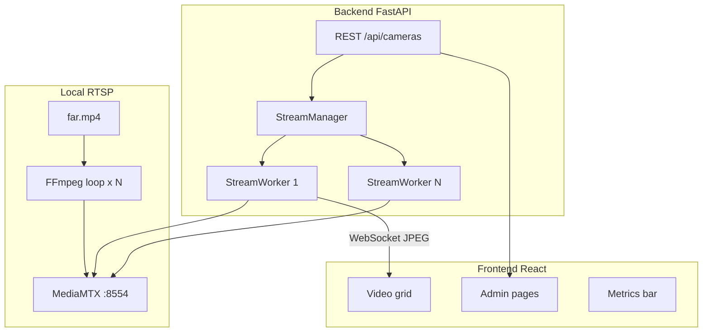

# Kiến trúc hệ thống — CamStream Manager (B1)

> Tài liệu chi tiết cho báo cáo. Phần tóm tắt ≤2 trang A4 nằm trong `docs/REPORT.md`.

## 1. Tổng quan

Hệ thống mô phỏng camera IP: file video công ty → RTSP local → backend ingest → web dashboard (tối đa 32 kênh).

## 2. Thành phần

| Layer | Công nghệ | Vai trò |
|-------|-----------|---------|
| RTSP publisher | Docker, FFmpeg, MediaMTX | Loop video → `rtsp://host:8554/cam1..` |
| API | FastAPI, SQLAlchemy, SQLite | CRUD camera, status, metrics, events |
| Ingest | OpenCV + FFmpeg backend | Pull RTSP, throttle FPS, JPEG encode |
| Transport | WebSocket | Đẩy frame + meta tới browser |
| UI | React + Vite | Grid 4/8/16/32, admin, status, events |
| Metrics | psutil, nvidia-smi / pynvml | CPU, RAM, GPU |

## 3. Luồng dữ liệu một kênh

1. Client đăng ký camera (`POST /api/cameras`) với `rtsp_url`.
2. `StreamManager` khởi chạy `StreamWorker` (1 thread).
3. Worker mở RTSP (`cv2.VideoCapture`), đọc frame, throttle theo `target_fps`.
4. Frame resize → JPEG → `ChannelState` cập nhật FPS/latency/status.
5. `broadcast` lưu `_latest_frame` và push WebSocket.
6. UI `StreamCell` hiển thị ảnh + poll `GET /api/cameras/{id}/status` mỗi 2s.

## 4. Quyết định thiết kế

### 4.1 RTSP thật (không đọc file trực tiếp)

Đáp ứng đề: reproduce bằng `docker compose up -d`.

### 4.2 WebSocket + JPEG (không WebRTC)

- **Ưu:** Kiểm soát FPS server-side; triển khai nhanh; dễ debug.
- **Nhược:** Băng thông cao hơn WebRTC/HLS khi scale 32 kênh.

### 4.3 Một thread / camera

- **Ưu:** Cô lập lỗi; map 1:1 với camera ID.
- **Nhược:** 32 thread decode — bottleneck CPU; giảm bằng throttle FPS từng ô.

### 4.4 FPS hot-reload

`update_fps_only()` đổi throttle không đóng RTSP (không tăng `reconnect_count`).

### 4.5 Giám sát trạng thái

- Timeout không frame 5s → fault.
- Auto-reconnect exponential backoff 1–30s.
- `log_fault` + `GET /api/events` cho lịch sử.

## 5. Mở rộng & vận hành

| Vấn đề | Cách xử lý hiện tại | Hướng scale |
|--------|---------------------|-------------|
| Đứt RTSP | Auto-reconnect | MediaMTX cluster |
| Decoder treo | Worker thread; có thể thêm watchdog process |
| RAM tăng | Release JPEG blob URL phía client | Shared memory / HLS |
| 8 → 80 kênh | Bottleneck: CPU decode | HW decode, edge node, lower FPS |

## 6. API chính

Xem `README.md`. Điểm quan trọng: tách **cấu hình camera** (DB) và **runtime state** (`ChannelState` in-memory).
